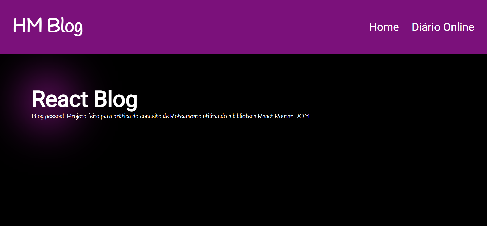
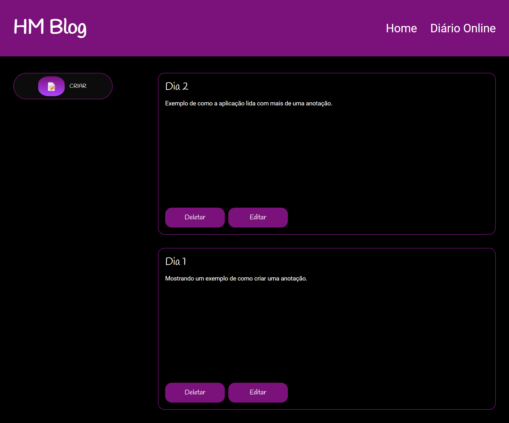

# Blog React

This application simulates a personal blog with the functionality to create, edit and delete notes.

## How to Clone and Run

To clone the project repository and run it on your local machine, follow the instructions below:

1. Clone the repository using the command `git clone <repository URL>`.
2. Navigate to the project directory: `cd resultado-loterias`.
3. Install the dependencies using the command `npm install`.
4. Run the application using the command `npm run dev`.
5. Access the application in your browser at `http://localhost:3000`.

Make sure you have Vite installed globally on your machine before proceeding.

## Layout

#

## Technologies Used

- React
- TypeScript
- JavaScript
- HTML
- CSS
- React Router
